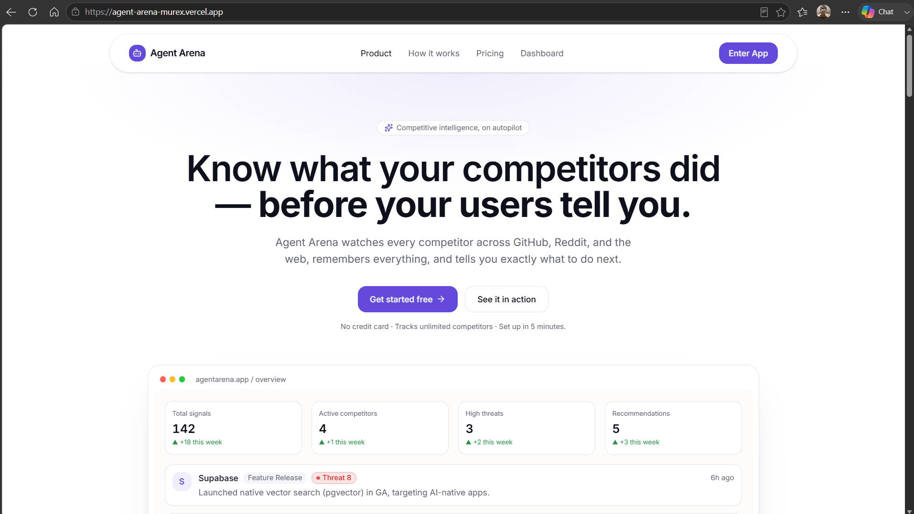
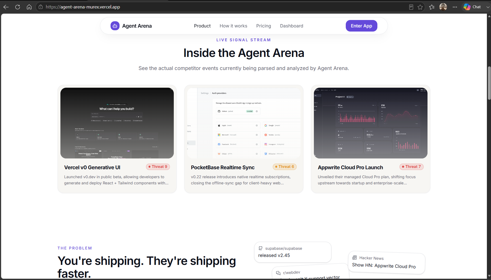
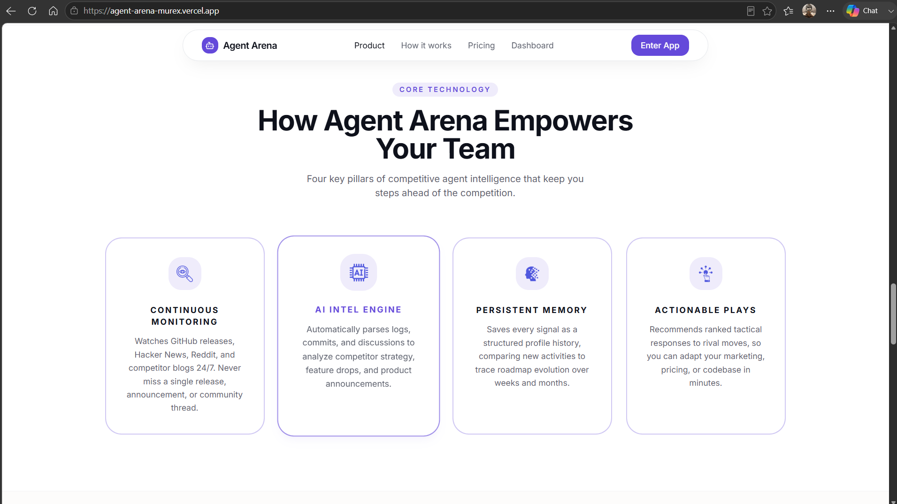
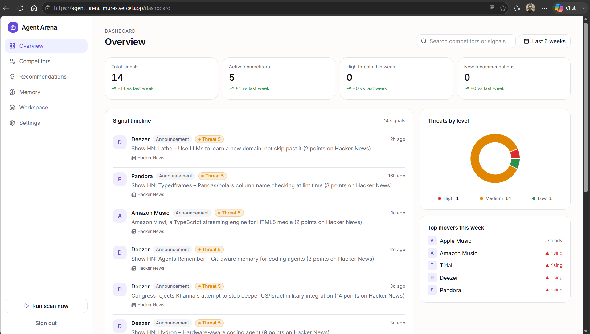
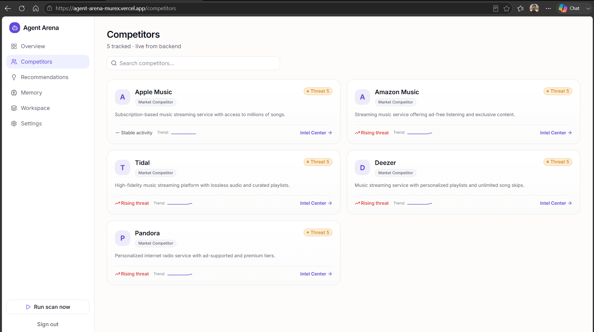
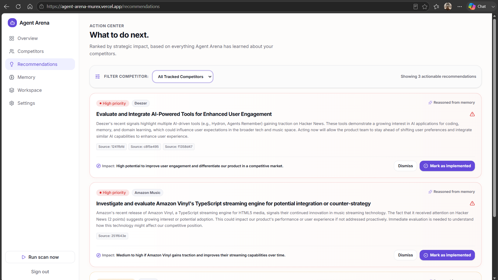
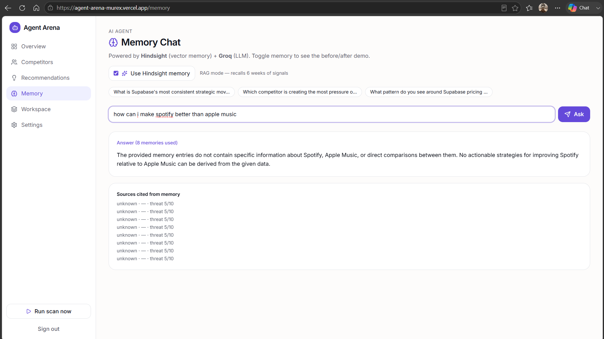
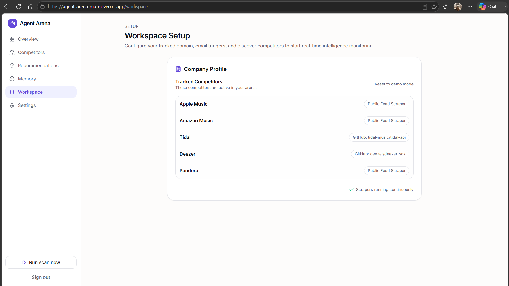
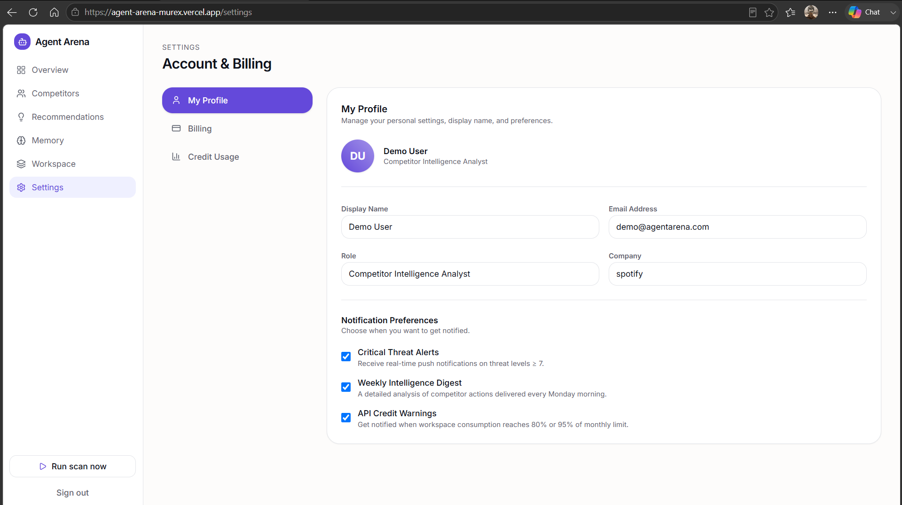

# Agent Arena

**Know what your competitors did — before your users tell you.**

AI-powered competitive intelligence agent built for **HackBaroda 2026** (Problem Statement 3). Agent Arena discovers your competitors from your website, collects live signals from GitHub and Hacker News, stores long-term memory in Hindsight, and uses Groq to classify threats, answer questions, and recommend actions.

---

## Problem Statement Selected

**HackBaroda 2026 — Problem Statement 3: Competitive Intelligence Agent**

Teams and indie builders lose deals because they discover competitor moves too late. Manual tracking (refreshing GitHub, skimming Reddit, reading Hacker News once a week) does not scale and produces no institutional memory. Alerts are noisy; patterns across weeks are missed.

**Core challenge:** Build an AI agent that continuously monitors competitors, remembers historical signals, detects patterns over time, and turns raw noise into actionable intelligence — using **Hindsight** (vector memory) and **Groq** (LLM) as required hackathon technologies.

---

## Solution Overview

Agent Arena is a full-stack competitive intelligence platform:

1. **Discover** — User enters company name and website; Groq AI identifies 4–6 direct competitors in the same niche.
2. **Collect** — Backend fetches GitHub releases, Reddit posts, and Hacker News stories for each tracked competitor.
3. **Classify** — Groq scores every signal (threat 1–10, type: feature release, security issue, etc.).
4. **Remember** — Every important signal is written to **Hindsight** as vector memory for semantic recall.
5. **Act** — Dashboard, competitor timelines, Memory Chat (RAG), and Groq-generated recommendations tell the user what to do next.

The differentiator is **memory**: the same question answered with Hindsight on vs off demonstrates why long-term competitive memory beats one-shot LLM queries.

```
User website → Groq discovers rivals → GitHub / Reddit / HN collection
      → Groq classification → Hindsight memory → Dashboard + Chat + Recommendations
```

---

## Features Implemented

### Workspace & Onboarding
- Per-user workspace setup (`/workspace`) with company, website, email, industry
- AI competitor discovery via Groq (`POST /api/workspace/discover`)
- Persistent workspace config (`Backend/data/workspace.json`)
- Dynamic competitor list scoped to the user's market (not a global static list)

### Data Collection
- **GitHub** — release notes and star counts via GitHub REST API
- **Reddit** — recent subreddit posts via `old.reddit.com` JSON API
- **Hacker News** — story search via Algolia HN API
- Manual **Run scan now** from the app sidebar (`POST /api/collect/run`)
- Optional scheduled collection via APScheduler (`COLLECT_INTERVAL_MINUTES`)
- Industry-aware Groq bootstrap signals after workspace setup when live collection is empty

### Intelligence Layer
- Threat scoring and signal classification (Groq)
- In-memory signal store with deduplication by source URL
- Hindsight write on every new signal; semantic recall for chat and patterns
- Memory Chat with **Hindsight on/off toggle** (`POST /api/chat`)
- Pattern insights per competitor (memory-based summaries)
- Actionable recommendations with priority, reasoning, and status updates
- Weekly digest generation (`POST /api/digest`)

### Frontend Application
- Marketing landing page with product story and memory advantage section
- instant demo login
- Dashboard with metrics, threat breakdown, signal feed, search
- Competitors list and per-competitor detail pages with timelines
- Recommendations page with implement/dismiss actions
- Memory Chat UI with suggested questions
- Settings (profile, billing, credit usage UI)
- How-it-works, pricing, docs, and supporting marketing pages

### API
- REST API under `/api` with OpenAPI docs at `/docs`
- CORS configured for local frontend origins
- Health check endpoint for connectivity monitoring

---

## Technology Stack

### Backend
| Technology | Purpose |
|------------|---------|
| **Python 3.11+** | Core language |
| **FastAPI** | REST API framework |
| **Uvicorn** | ASGI server |
| **Groq** (`qwen/qwen3-32b`) | Discovery, classification, chat, recommendations |
| **Hindsight Cloud** | Vector memory — store and recall competitive signals |
| **httpx** | Async HTTP client for GitHub, Reddit, HN |
| **APScheduler** | Background collection scheduler |
| **Pydantic** | Request/response validation |
| **python-dotenv** | Environment configuration |

### Frontend
| Technology | Purpose |
|------------|---------|
| **React 19** | UI framework |
| **TanStack Router / Start** | File-based routing and SSR |
| **TanStack Query** | Server state and API caching |
| **TypeScript** | Type-safe frontend |
| **Tailwind CSS 4** | Styling |
| **Radix UI** | Accessible components |
| **Recharts** | Dashboard charts |
| **Vite** | Build tool and dev server |

### External APIs
- GitHub REST API (releases, repo metadata)
- Reddit JSON API (subreddit posts)
- Hacker News Algolia API (story search)
- Groq OpenAI-compatible API
- Hindsight Cloud API

---

## UI Screenshots

### Landing Page
Marketing homepage with hero, value proposition, and dashboard preview.



### Live Signal Stream
Real-time competitor events parsed and analyzed by the agent.



### Core Technology
Four pillars: Continuous Monitoring, AI Intel Engine, Persistent Memory, and Actionable Plays.



### Dashboard Overview
Metrics, signal timeline, threat breakdown, and top movers for tracked competitors.



### Competitors
Discovered rivals with threat levels, activity trends, and intel center links.



### Recommendations
Actionable plays ranked by priority, reasoned from Hindsight memory.



### Memory Chat
Hindsight + Groq RAG chat with memory on/off toggle and cited sources.



### Workspace Setup
Company profile and tracked competitors after AI discovery.



### Settings & Profile
Account management, notification preferences, and workspace identity.



---

## Project Structure

```
AgentArena/
├── Backend/
│   ├── main.py              # FastAPI app entry, CORS, lifespan
│   ├── routes.py            # All /api endpoints
│   ├── collector.py         # GitHub, Reddit, HN fetchers
│   ├── classifier.py        # Groq signal classification
│   ├── discovery.py         # Groq competitor discovery
│   ├── memory.py            # Hindsight read/write
│   ├── llm.py               # Shared Groq helpers
│   ├── recommender.py       # Groq recommendations
│   ├── store.py             # In-memory signals & metrics
│   ├── workspace_store.py   # Persisted workspace JSON
│   ├── competitors.py       # Tracked competitor config
│   ├── seed.py              # Historical signal seeding
│   ├── scheduler.py         # Optional cron collection
│   ├── models.py            # Pydantic schemas
│   ├── requirements.txt
│   └── .env.example
├── Frontend/
│   ├── src/routes/          # Pages (dashboard, workspace, memory, …)
│   ├── src/lib/api.ts       # Backend API client
│   ├── src/components/      # UI components
│   └── .env.example
├── docs/screenshots/        # UI screenshots for README
└── README.md
```

---

## Project Live deployed

Frontend - https://agent-arena-murex.vercel.app/
Backend - https://agentarena-a561.onrender.com


## Setup Instructions (For Local Host)

### Prerequisites
- **Python 3.11+**
- **Node.js 18+** and **npm**
- Accounts: [Groq](https://console.groq.com), [Hindsight](https://ui.hindsight.vectorize.io), [Supabase](https://supabase.com) (for auth), optional [GitHub PAT](https://github.com/settings/tokens)

### 1. Clone the repository

```bash
git clone https://github.com/Sumit-Patel08/AgentArena.git
cd AgentArena
```

### 2. Backend setup

```powershell
cd Backend
python -m venv venv
venv\Scripts\activate          # Windows
# source venv/bin/activate     # macOS/Linux

pip install -r requirements.txt
copy .env.example .env         # Windows
# cp .env.example .env         # macOS/Linux
```

Edit `Backend/.env`:

```env
HINDSIGHT_API_KEY=your_key
HINDSIGHT_COLLECTION_ID=agent-arena-ci
HINDSIGHT_BASE_URL=https://api.hindsight.vectorize.io
GROQ_API_KEY=your_groq_key
GITHUB_TOKEN=optional_github_pat
ALLOWED_ORIGINS=http://localhost:8080,http://127.0.0.1:8080
COLLECT_INTERVAL_MINUTES=60
```

Apply Hindsight promo code **MEMHACK6** in billing for $50 credit.

Start the backend:

```powershell
venv\Scripts\uvicorn main:app --reload --port 8000
```

- API: http://127.0.0.1:8000  
- Swagger docs: http://127.0.0.1:8000/docs  

Verify APIs:

```powershell
venv\Scripts\python scripts\verify_apis.py
```

### 3. Frontend setup

```powershell
cd Frontend
npm install --legacy-peer-deps
copy .env.example .env
```

Edit `Frontend/.env`:

```env
VITE_API_BASE_URL=http://127.0.0.1:8000
```

Configure Supabase in `Frontend/src/lib/supabase.ts` (project URL and anon key).

Start the frontend:

```powershell
npm run dev
```

Open http://localhost:8080

### 4. First-run workflow

1. Sign in at `/login` (or use **Instant Demo Login**)
2. Go to **Workspace** (`/workspace`)
3. Enter company name, website, and industry
4. Click **Discover Competitors** — wait for Groq to return rivals
5. Click **Start Live Monitoring**
6. Click **Run scan now** in the sidebar to fetch live GitHub/HN signals
7. Explore **Dashboard**, **Memory** (toggle Hindsight on/off), and **Recommendations**

---

## API Endpoints

| Method | Endpoint | Description |
|--------|----------|-------------|
| GET | `/api/health` | Health check |
| GET | `/api/workspace` | Current workspace status |
| POST | `/api/workspace/discover` | Groq competitor discovery |
| POST | `/api/workspace/setup` | Save workspace and start monitoring |
| POST | `/api/workspace/reset` | Reset workspace |
| GET | `/api/signals` | List signals (optional `?competitor=id`) |
| GET | `/api/competitors` | Competitor summaries |
| GET | `/api/competitors/{id}` | Competitor detail + timeline |
| GET | `/api/metrics` | Dashboard metrics |
| POST | `/api/chat` | Memory chat (`use_memory: true/false`) |
| GET | `/api/recommendations` | List recommendations |
| POST | `/api/recommendations/{id}/status` | Update recommendation status |
| POST | `/api/digest` | Generate weekly digest |
| POST | `/api/collect/run` | Run live collection pipeline |

---

## Environment Variables

### Backend (`Backend/.env`)

| Variable | Required | Description |
|----------|----------|-------------|
| `HINDSIGHT_API_KEY` | Yes | Hindsight Cloud API key |
| `HINDSIGHT_COLLECTION_ID` | Yes | Hindsight bank/collection ID |
| `HINDSIGHT_BASE_URL` | Yes | Hindsight API base URL |
| `GROQ_API_KEY` | Yes | Groq API key |
| `GITHUB_TOKEN` | No | GitHub PAT for higher rate limits |
| `ALLOWED_ORIGINS` | Yes | Comma-separated frontend URLs for CORS |
| `COLLECT_INTERVAL_MINUTES` | No | Scheduled scan interval (default 60) |

### Frontend (`Frontend/.env`)

| Variable | Required | Description |
|----------|----------|-------------|
| `VITE_API_BASE_URL` | Yes | Backend URL (e.g. `http://127.0.0.1:8000`) |

---

## Demo Tips for Judges

1. Start at **Workspace** — discover competitors for a real company
2. **Run scan now** — show a signal with a real GitHub release URL
3. **Memory Chat** — ask the same question with memory **on** vs **off**
4. Mention: GitHub + HN are live; Reddit may return 403 without OAuth

---

## Team & Event

- **Event:** HackBaroda 2026  
- **Problem Statement:** 3 — Competitive Intelligence Agent  
- **Repository:** https://github.com/Sumit-Patel08/AgentArena  

---

## License

Built for HackBaroda 2026 hackathon submission.
